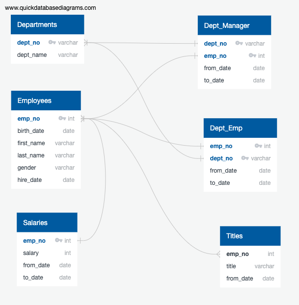

# Pewlett Hackard Analysis

## Overview
Pewlett Hackard is a large, long-standing company employing thousands of employees. The company has a large proportion of it's workforce belonging to the baby boomer generation, and these employees will be expected to reach their retirement soon. This anticipated en masse retirement has been dubbed by executives of the company as the impending "silver tsunami", and they would like to plan ahead to prepare the company for this massive change ahead.

Our task in supporting Human Resources' employee research team, is to design and create an employee database in SQL (Structured Query Language). We will then query the database, using SQL, to derive the required analysis and determine how many people are retiring, as well as who will be eligible for a retirement package.

We will also tackle a Challenge in addition to this work in order to determine the number of pending retirees per job title (role), and identify who are to participate in a mentorship program before retirement. By completing these tasks we will successfully fulfill our role to aid management in future-proofing the company's workforce after the older generation of employees retire.

Below is the ERD (Enitity Relationship Diagram) for the Pewlett Hackard employee database we designed.

__ERD__  

## Results

### Challenge Deliverable 1: The Number of Retiring Employees by Title

To begin this part of the analysis, we created a table called 'retirement_titles' (displayed below) that holds all the titles of employees who were born between January 1, 1952 and December 31, 1955. The table returned 133,766 rows of data. However, some employee ID numbers were duplicated since a single employee can hold multiple titles throughout their career at the company. 

__retirement_titles__

In order to deal with the duplicate rows, so that only a single title is displayed for each unique employee ID, we created another table called 'unique_titles' (displayed below). The 'unique_titles' table holds the employee ID, first name, last name, and the most recent title for each employee in the 'retirement_titles' table. The table returned 72,458 rows of data. This means that there were over 60,000 duplicate rows removed, leaving us with 72,458 individual current employees reaching retirement soon.  

__unique_titles__

At this point in the analysis, we had a table of all the soon retiring current employees and their job titles. We decided that we would also like to aggregate employee count data for each job title among the retiring employees. To complete this task, we created a table called 'retiring_titles' (displayed below). The table holds each of the 7 different job titles, among the retiring employees, and their respective total title counts. 

__retiring_titles__  

### Challenge Deliverable 2: The Employees Eligible for the Mentorship Program

Our next goal was to identify employees who are eligible to participate in a mentorship program. We defined mentorship eligible employees as current employees who were born between January 1, 1965 and December 31, 1965. We created the table 'mentorship_eligibility' (displayed below) to hold identifying information on each current employee born in the mentorship-eligibility defined date range. The information in the table includes, employee ID, first name, last name, birth date, start of employment date, a column ('to_date') that identifies the employee as currently employed when the value is '9999-01-01', and the employee's job title. The table returned 1,549 rows, and each row contains a distinct employee ID signifying that there are 1,549 mentorship-eligible current employees.

__mentorship_eligibility__

### Key Takeaways
- There are 72,458 current employees ready to retire, which makes up approximately 24.2% of the company's total workforce.
- Many Senior Engineer and Senior Staff roles will be vacant once the retirement-eligible employees retire. 25,916 Senior Engineers out of 85,939 total Senior Engineers at the company will retire soon. 24,926 Senior Staff out of 82,024 total Senior Staff at the company will retire soon.
- While the company is only losing 2 Managers, there are only 9 Managers employed at the company in total. We may want to research the importance of the rare 'Manager' title to properly assess the impact of losing 2 out of 9 Managers, as well as how difficult it will be to replace their roles.
- There are only 1,549 mentorship-eligible employees, as compared to 72,458 expected vacancies to eventually be filled with new hires. We should consider the impact of expanding the age range for mentorship-eligibility, as the current ratio suggests employee mentors may have too many mentees to sufficiently manage.

## Summary

### Key Questions Answered

At a high-level, we have provided answers to the following key questions regarding Pewlett Hackard's expected upcoming mass retirement challenge.

- How many roles will need to be filled as the "silver tsunami" begins to make an impact?
  
  - 72,458 roles will need to be filled once all retirement-eligible employees retire.
 
 

- Are there enough qualified, retirement-ready employees in the departments to mentor the next generation of Pewlett Hackard employees?

  - In our estimation, there are not enough qualified, retirement-ready employees in the departments to mentor the next generation of Pewlett Hackard's employees. Currently there are 1,549 mentorship-eligible employees and 72,458 expected vacancies. This would leave mentors with an expected 46 or 47 mentees to supervise each. We believe that is too much of a workload than should be expected from this program. It may be advisable to find ways to expand the mentorship-eligibility pool. One such way could be to broaden the mentorship-elibility age range.
 
 

### Addtional Tables for Further Research

These additional tables are provided to provide more insight into the upcoming "silver tsunami."

__Table 1__

__expanded_mentorship_eligibility__

The above table returns 19,905 rows, representing mentorship-elibile employees when eligibility includes employees born from January 1, 1964 to December 31, 1965. Just by extending the age range by 1 year the result presents a more favorable ratio of mentors to expected vacancies, as each mentor would be expected to have 3 or 4 mentees.

__Table 2__

__mentorship_titles__  

The above table returns counts per title of mentorship-elibile employees when eligibility includes employees born from January 1, 1964 to December 31, 1965. This table confirms there is an even spread and consistent ratio of mentors to mentees across all titles. This table does provide two interesting insights. There are more Staff than Senior Staff in the mentorship eligibility pool, while the inverse is true for the retiring employees. Perhaps the mentorshiple-eligble Staff will be ready for promotion to Senior Staff once the "silver tsunami" wave hits. Such a promotion would not only fill a portion of the expected Senior Staff vacancies, but also provide more mentorship-eligible Senior Staff to mentor newly hired Senior Staff. Alternatvely, Senior Staff and Staff could be treated equivalently for the purposes of the mentorship program, since mentorship eligibity by age already factors in an expected level of experience. Additionally, it is apparent that there are no mentorship-eligible Managers, while 2 Manager vacancies are expected to be filled with new hires. Perhaps different mentorship-elibility requirements should be determined for the Manager title, so that the incoming Manager hires are included in the mentorship program.